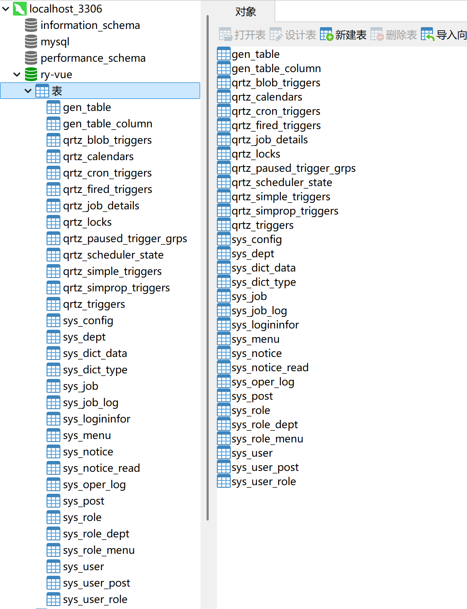
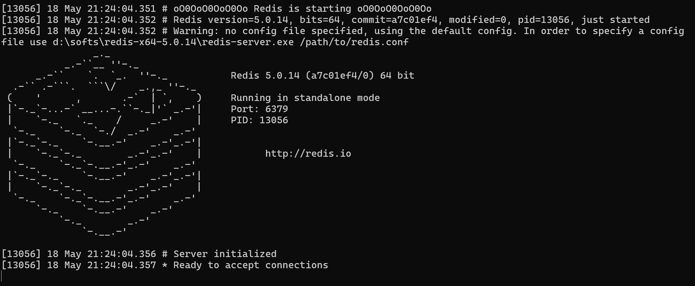
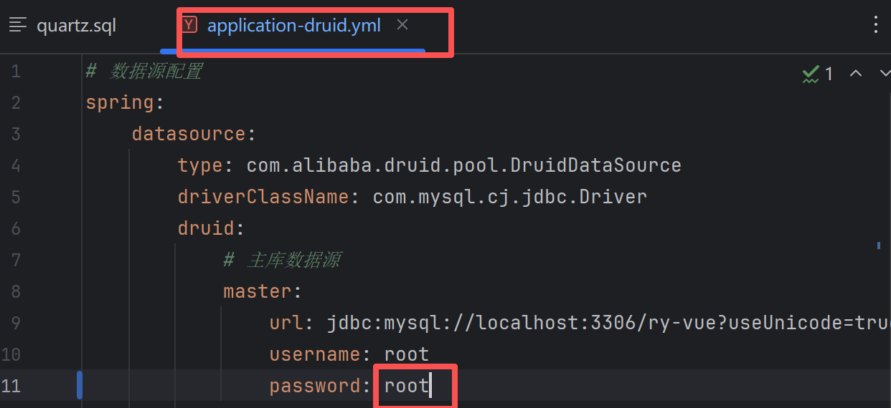
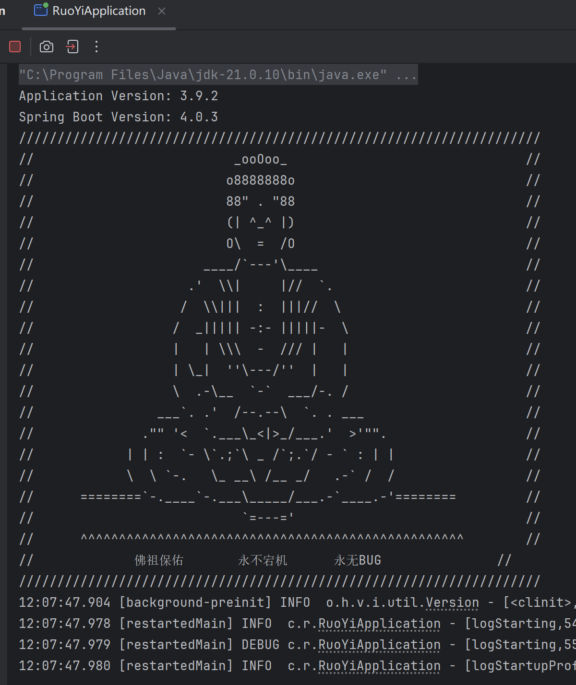
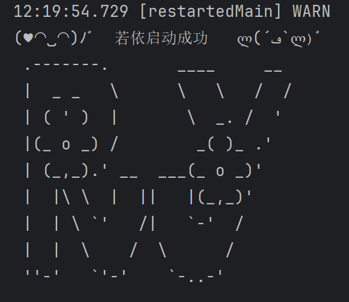
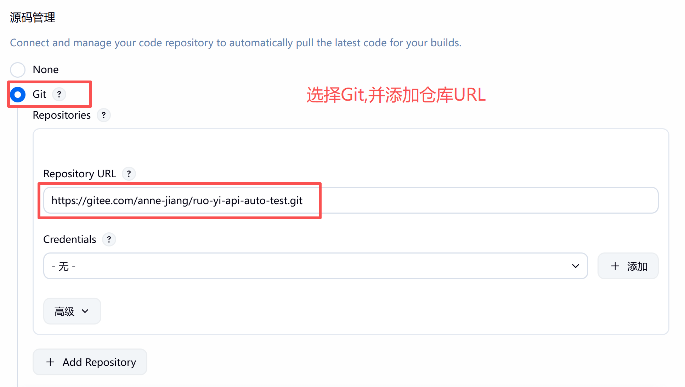
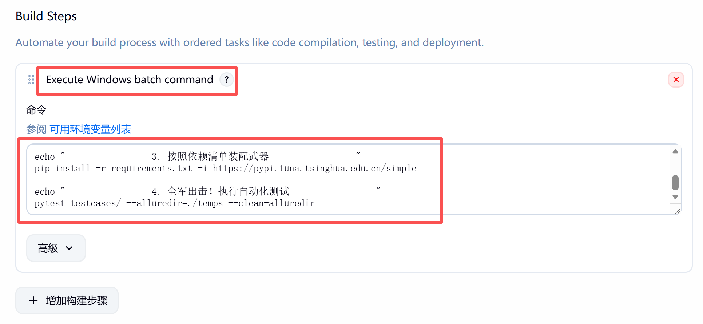
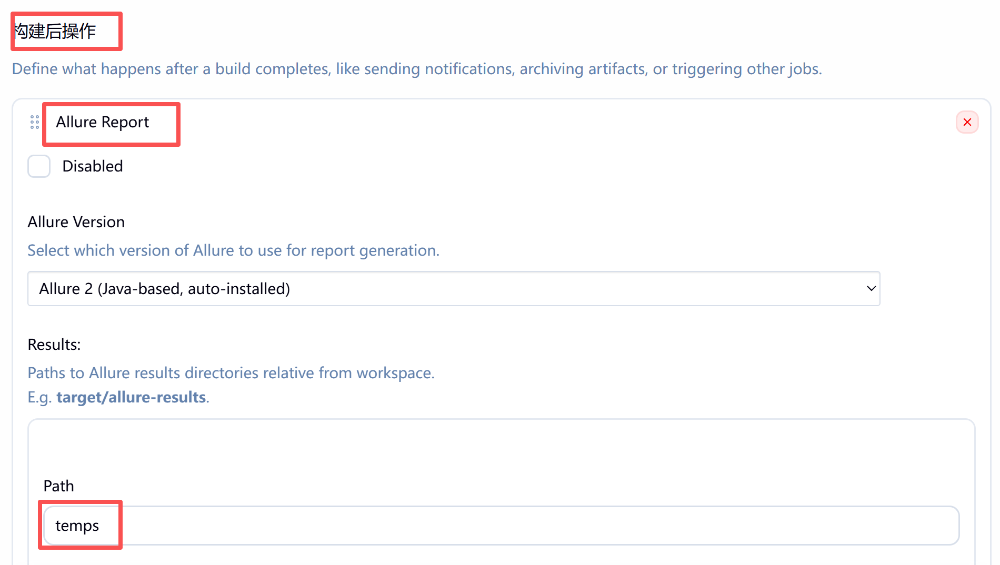
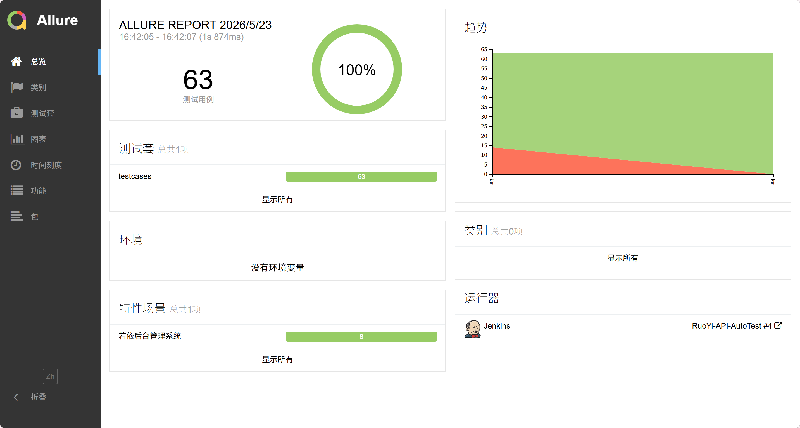

# 若依系统 (RuoYi) 接口自动化测试项目

## 一、项目简介

本项目是针对企业级开源框架“若依后台管理系统（RuoYi-Vue）”深度定制的 API 接口自动化测试工程。项目实现了从单点接口测试到全生命周期无痕闭环的跨越，符合大厂 DevOps 流水线对自动化框架“零人工干预、可重复执行”的严苛标准。

项目涵盖了用户与角色、部门管理、岗位管理、登录认证、菜单管理、公告管理以及参数设置等 8 个核心模块的 49 个接口，共计落地 63 条自动化测试用例。

## 二、框架设计与目录结构

项目采用高内聚、低耦合的分层架构设计思想，将配置、数据、逻辑与输出严格分离：

- **`config/` (配置层)**：存放全局环境域名与数据库账号密码，支持测试环境与预发布环境的一键切换。
- **`data/` (数据层)**：存放 `YAML` 格式的测试数据，彻底实现数据驱动测试 (Data-Driven)，降低用例维护成本。
- **`common/` (工具层)**：沉淀全局共享的基础组件，如二次封装的 Requests 请求库、数据库连接工具与日志格式化工具。
- **`api/` (接口对象层)**：基于 API Object 模式，将零散的接口抽象为代码对象，统一管理 URL 与请求方式，坚决不在本层写入任何断言，保持请求层的绝对纯净。
- **`testcases/` (测试用例层)**：前线执行主战场，负责读取数据、调用接口、连接数据库并利用 Pytest 完成严密的业务断言。
- **`outputs/` (输出层)**：自动收集黑底白字的纯文本运行日志与精美直观的 Allure 网页版可视化测试报告。

## 三、核心技术亮点

本项目攻克了传统接口自动化测试中的多项底层技术痛点，构建了极具鲁棒性的测试引擎。

### 1. 全局时间戳与静态数据防冲突机制

底层拦截并替换 `${TIMESTAMP}` 占位符，生成纯动态且绝对唯一的测试数据，彻底杜绝了因系统唯一性校验（如账号重复）导致的二次构建崩溃。

+ 确保用例顺序执行（先增、再改、后删）。
+ 防重复：凡是系统要求唯一的字段（如名称、编码、账号、手机号），全部加上 `${TIMESTAMP}`。

### 2. 全局记忆中枢与全链路上下文流转

通过代码编排拦截 `POST` 成功响应，逆向调用查询接口精准捕获动态主键（如 `userId`、`deptId`），并存入全局缓存（`GlobalVars`），打通了“造数 -> 提取 -> 传参 -> 销毁”的无状态测试闭环。

```python
class GlobalVars:
    """全局变量记忆中枢"""

    # 预留给各模块的动态 ID
    dynamic_menu_id = None
    dynamic_dept_id = None
    dynamic_role_id = None
    dynamic_post_id = None
    dynamic_user_id = None
    dynamic_config_id = None
    dynamic_notice_id = None
```

### 3. 条件标识符 (暗号)

引入 `"DYNAMIC"` 关键字约定，代码在执行修改或删除操作时，智能识别并替换为全局缓存的动态 ID；遇到预设的静态 ID（用于反向异常测试）时则严格保留，实现了正向动态流转与反向异常用例的完美共存。

+ 凡是在“修改”和“删除”用例中，指向我们刚刚新增的数据的 ID，全部改写为暗号 `"DYNAMIC"`。系统自带的死数据（如 ID 为 1 的系统管理员）保持不变。

+ **示例**：

  ```yaml
  # 场景3: 修改岗位
  update_post_cases:
    # 场景：正常修改
    - postId: "DYNAMIC"
      postCode: "test_engineer_${TIMESTAMP}"
      postName: "高级测试开发专家_${TIMESTAMP}"
      postSort: 1
      status: "0"
      expected_code: 200
  ```

### 4. 若依底层响应机制深度剖析

- 精准适配 Spring Boot 后端的响应实体规范，灵活处理标准操作的 `AjaxResult` (data 解析) 与强制分页列表的 `TableDataInfo` (rows 解析)。

## 四、环境部署与运行

### 1. 被测系统本地部署

+ 克隆若依源码：

  ```bash
  git clone https://gitee.com/y_project/RuoYi-Vue.git
  ```

+ 新建数据库并导入 SQL 脚本。
  

+ 启动本地 Redis 缓存服务：
  - 下载 Redis 依赖官方地址：[https://github.com/tporadowski/redis/releases](https://github.com/tporadowski/redis/releases)
  - 打开此黑框不要关闭。
    

+ 打开 IDEA --> 修改 `ruoyi-admin/src/main/resources` 下的数据库用户名和密码。
  

+ 运行 `RuoYiApplication.java` 启动服务。
  
  

### 2. 自动化框架本地运行

- 进入项目工作目录。
- 初始化并激活独立虚拟环境：`python -m venv .venv`。
- 安装项目依赖：`pip install -r requirements.txt -i https://pypi.tuna.tsinghua.edu.cn/simple`。
- 执行全量测试并生成报告：`pytest testcases/ --alluredir=./temps --clean-alluredir`。

### 3. Jenkins CI/CD 流水线接入

- 将自动化代码推送到 GitHub 远程仓库：[https://github.com/hxcong666/ruo-yi-api-auto-test.git](https://github.com/hxcong666/ruo-yi-api-auto-test.git)。

- 在 Jenkins 中新建项目，配置代码源地址与触发器：
  - 添加仓库 URL。
    
  - 添加构建步骤。
    

- 注入 Windows 批处理构建脚本（创建虚拟环境、安装依赖、执行 Pytest）：
  ```bat
  echo "================ 1. 进入工作目录 ================"
  cd %WORKSPACE%

  echo "================ 2. 召唤本地 Python 引擎 ================"
  :: 激活虚拟环境 (请根据实际路径修改)
  call .venv\Scripts\activate

  echo "================ 3. 引擎就绪执行测试 ================"
  pytest testcases/ --alluredir=./temps --clean-alluredir
  ```

- 配置构建后操作，自动收集 `temps` 文件夹并生成 Allure 测试战报：
  - 构建后操作：选择 Allure 测试报告，路径选择 Python 项目下的 `temps` 文件夹。
    

## 五、测试战果总览

| **模块名称** | **涵盖接口数** | **自动化用例数** | **攻克的核心技术难点** |
| --- | --- | --- | --- |
| **用户与角色** | 10 个 | 16 条 | YAML 数据驱动落地、底层 Request 二次封装、初步打通 Allure 可视化。 |
| **部门管理** | 4 个 | 5 条 | 树状层级逻辑处理、精准区分系统崩溃与业务拦截。 |
| **岗位管理** | 6 个 | 6 条 | 熟练实现标准 CRUD 增删改查的全链路闭环。 |
| **登录与认证** | 6 个 | 10 条 | 绕过验证码、全自动提权注入、退出接口的“一次性 Token”隔离战术。 |
| **菜单管理** | 8 个 | 9 条 | 跨越路由唯一性拦截、捕获前后端参数命名规范引发的隐蔽 Bug。 |
| **公告管理** | 9 个 | 9 条 | 复杂参数类型处理（URL Query 与 Body 混用）、批量状态变更。 |
| **参数设置** | 7 个 | 8 条 | 特殊请求方式处理、避开核心参数内置保护锁。 |
| **总计** | **49 个接口** | **63 条用例** | **企业级自动化兵工厂已具备成规模量** |

通过上述三套机制的组合，该自动化工程完成了从“单点执行”到“全生命周期无痕闭环”的蜕变（造数 -> 提取 -> 传参 -> 清理销毁），符合大厂 DevOps 流水线对自动化框架“零人工干预、可重复执行”的严苛标准。


